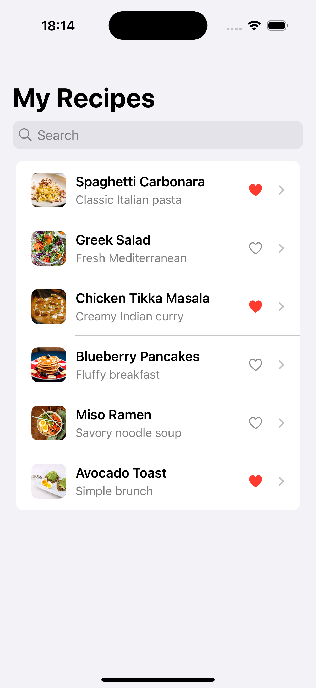

# RecipeApp

A simple iOS recipe browsing app built with SwiftUI as part of my iOS development learning path.

## Features

- Browse recipes
- Real-time search
- Favorite and unfavorite recipes
- Recipe detail screen
- Ingredients list
- SwiftUI navigation

## Built With

- Swift
- SwiftUI
- Xcode

## What I Practiced

- Swift data models
- `Identifiable`
- `@State`
- computed properties
- `NavigationStack` and `NavigationLink`
- `List` and `ForEach`
- `.searchable()`
- closures and callbacks
- reusable SwiftUI views
- state-driven UI updates

## Screenshots

## Course Context

This project was completed as the final project for IBM's **Get Started with iOS App Development** course.

## Images

The local recipe images were downloaded from Unsplash for this educational project:

- [Spaghetti](https://images.unsplash.com/photo-1612874742237-6526221588e3)
- [Salad](https://images.unsplash.com/photo-1540420773420-3366772f4999)
- [Chicken](https://images.unsplash.com/photo-1603894584373-5ac82b2ae398)
- [Pancakes](https://images.unsplash.com/photo-1528207776546-365bb710ee93)
- [Ramen](https://images.unsplash.com/photo-1569718212165-3a8278d5f624)
- [Avocado toast](https://images.unsplash.com/photo-1541519227354-08fa5d50c44d)

